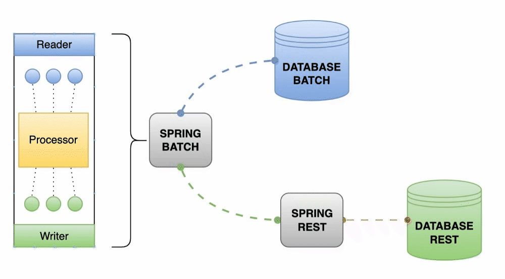

# Spring Batch

Procesamiento en lote de información de una base de datos a un servicio REST

## Stack

- SpringBoot 3.1.3
- JPA
- JDK17
- Maven
- Postgres
- Docker | Docker Compose


## Build (Opcional)

```shell
mvn clean package
```

## Run
```shell
docker-compose -f docker-compose.yaml -p spring-batch-rest up -d --build
``` 
## DOWN
```shell
docker-compose -f docker-compose.yaml -p spring-batch-rest down --rmi local --remove-orphans --volumes
```

## Arquitectura
